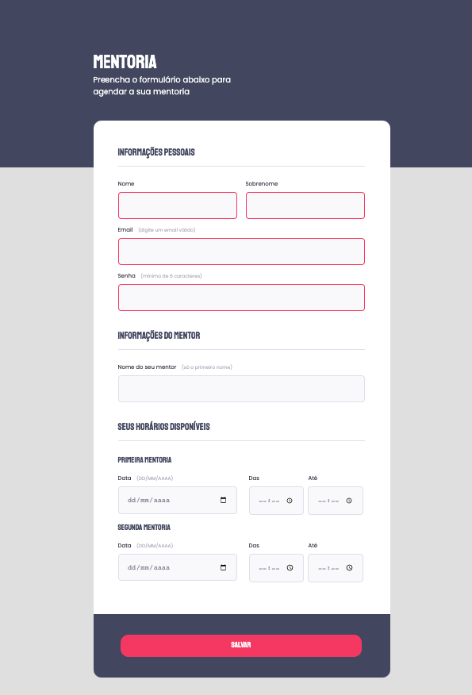

# Formulário

>Bootcamp Explorer

Exercício de fixação da aula de formulário, desenvolvido através do modelo disponibilizado no Figma 

[🔗 Link do projeto -  FIGMA](https://www.figma.com/file/Ao6zK1LPLgo47m4QyNliBq/Stage-03---Formul%C3%A1rio-intermedi%C3%A1rio-(Copy)?node-id=3%3A4)

## ⚒️ Tecnologias

- HTML
- CSS
- Git e Github

## ✉️ Contato

an.barros99@gmail.com